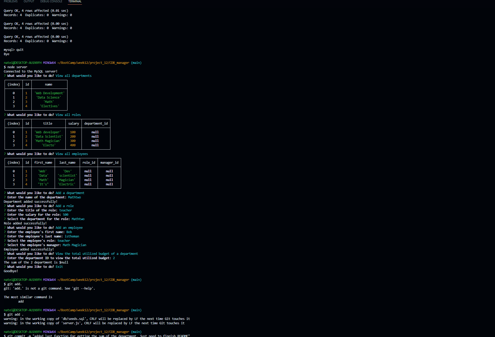

# CMS Employee Tracker
The project for week 12---Creating an employee tracker

## Table of Contents
 - [Installation](#installation)
 - [usage](#usage)
 - [License](#license)
 - [Features](#featues)
 - [Contribution Guidelines](#contributing)
 - [Questons/Contact](#questions)

## Installation
You will need:
1. Node downloaded onto your machine.
2. Express also downloaded and initiated.
3. Inquirer package downloaded and initiated.

## Usage
Enter node server into the command terminal to initiate the program, then you will be presented with many options to interact with the employee database. Follow the subsequent promptings in order to add, delete or upadate the database! Or hit exit to exit.

## License
This project does not currently have a license.

## Features
There are many options to interact with the database, they include:
- View all departments
- View all departments
- View all roles
- View all employees
- Add a department
- Add a role
- Add an employee
- Update an employee role
- Upadate an employee manager
- View Employees by manager
- View Employees by department
- Delete a department
- Delete a role
- Delete an employee
- View the total utilized budget of a department

All of this options are avalaible to the user upon initizuionb. This all of different functions that will allow the user to interact with the database at their leisure.

### Link to walkthorugh video
https://drive.google.com/file/d/1aHRD2DRxVsFq-wRE9bIE7Xh1pNn6jT6b/view

## Contribution Guidelines
This is a private project for instructional purposes. Future contributions are unlikely but possible.

### Questions
For any questions, please contact me:

GitHub: [imdawizard](https://github.com/imdawizard)

Email: nate.is.cool.yeah@gmail.com

## Link to deployed application:
https://imdawizard.github.io/CDB_manager/

## Screenshot:

